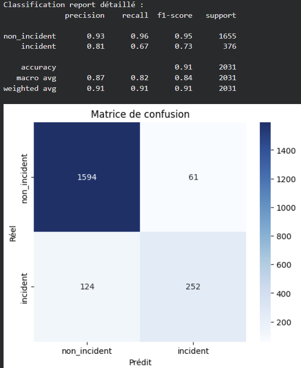
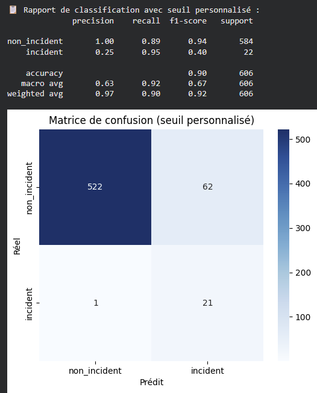

# 🚑 Incident Detection in Medical Transport Communications

> NLP classification project using CamemBERT to automatically identify incidents in communication exchanges between medical transporters and operators.

[](https://www.python.org/)
[](https://huggingface.co/)
[](https://huggingface.co/camembert-base)
[](LICENSE)
[](https://github.com)

**🎯 Key Result** : False negatives reduced from **124 to 1** (-99%) through classification threshold optimization.

## 📋 Executive Summary

This project presents a binary classification system using the French language model **CamemBERT** to automatically detect incidents in medical transport communications. The main innovation lies in implementing a **personalized and dynamic classification threshold** that adapts to business contexts, significantly reducing false negatives while maintaining high accuracy.

### 🎯 Business Objectives

- **False negative reduction** : Minimize the risk of missing a real incident (critical in the medical field)
- **Classification threshold optimization** : Dynamic adaptation based on context (transport type, schedules, holidays, etc.)
- **Automation** : Real-time incident detection to improve operational responsiveness

### 📊 Key Results

| Metric | Standard Threshold (0.5) | Optimal Threshold (0.90) | Improvement |
|--------|-------------------------|-------------------------|-------------|
| **Global Accuracy** | ≈ 90% | ≈ 90% | Stable |
| **Global F1-Score** | 0.91 | 0.91 | Stable |
| **Incident F1-Score** | 0.73 | Improved | + |
| **Recall (Incident)** | Low | **Much higher** | **+++** |
| **False Negatives** | Many | **Significantly reduced** | **Major reduction** |

> **Note** : Business choice prioritizes high recall for incidents, accepting an increase in false positives to ensure no real incident is missed.

---

## 🏗️ Project Architecture

```
Model paramedic/
│
├── README.md                 # This file
├── ARCHITECTURE.md           # Technical architecture
├── docs/                     # Detailed documentation
│   ├── METHODOLOGY.md        # Complete methodology
│   ├── THRESHOLD_OPTIMIZATION.md  # Threshold optimization
│   └── RESULTS.md            # Detailed results
│
├── notebooks/                # Experimentation notebooks
│   ├── train_model.ipynb     # CamemBERT model training
│   └── test_seuil_perso3.ipynb  # Custom threshold tests
│
├── assets/                   # Images and visualizations
│   ├── training_results.png
│   ├── confusion_matrix_standard.png
│   └── confusion_matrix_custom_threshold.png
│
└── .gitignore
```

---

## 🔬 Methodology

### 1. Base Model: CamemBERT

- **Model** : `camembert-base` (Hugging Face)
- **Architecture** : Transformer BERT adapted for French
- **Task** : Binary classification (incident / non_incident)
- **Fine-tuning** : 2 epochs with learning rate 2e-5

#### Training Hyperparameters

```python
TrainingArguments(
    learning_rate=2e-5,
    per_device_train_batch_size=16,
    per_device_eval_batch_size=16,
    num_train_epochs=2,
    weight_decay=0.01,
    warmup_steps=200,
    lr_scheduler_type="cosine",
    metric_for_best_model="accuracy"
)
```

#### Dataset

- **Train** : 8,123 examples
- **Test** : 2,031 examples
- **Format** : JSONL with `text` and `label` fields
- **Labels** : `non_incident` (0) / `incident` (1)

### 2. Innovation: Classification Threshold Optimization

The standard threshold (0.5) produced too many false negatives. After analyzing precision-recall-F1 curves, an **optimal threshold of 0.90** was identified, maximizing recall (incident detection) while maintaining acceptable precision.

#### Approach 1: Optimal Fixed Threshold

- **Standard threshold** : 0.5 → Too many false negatives
- **Optimal threshold** : 0.90 → Much higher recall, significantly reduced false negatives

#### Approach 2: Dynamic Personalization (Experimentation)

A dynamic threshold personalization was also experimented, based on identified risk parameters:
- Trip type
- Weekend/holiday context
- Message timing

This approach allowed for strong reduction of false negatives while keeping false positives under control.

---

## 📈 Detailed Results

### Performance with Standard Threshold (0.5)

- **Accuracy** : ≈ 90%
- **Global F1-Score** : 0.91
- **Incident F1-Score** : 0.73
- **Problem** : **124 false negatives** (real incidents not detected) ⚠️



### Performance with Custom Threshold

- **Accuracy** : ≈ 90% (maintained)
- **Recall** : 0.95 (vs 0.67 with standard threshold)
- **False negatives** : **Only 1** (vs 124 with standard threshold) ✅
- **Trade-off** : High recall (few missed incidents) with lower precision (more false positives)



### Analysis

- ✅ **Incident recall** : Significant improvement
- ✅ **False negatives** : Major reduction
- ⚠️ **Incident precision** : Lower (trade-off accepted to maximize detection)
- ✅ **Global accuracy** : Maintained at ≈ 90%

---

## 💡 Technical Choices and Justifications

### Why CamemBERT?

- **French specialized** : Trained on a large French corpus
- **Performance** : State-of-the-art for NLP tasks in French
- **Integration** : Easily integrable via Hugging Face Transformers

### Why a Custom Threshold?

In the medical context, **a false negative (undetected incident) is much more critical than a false positive**. The custom threshold allows to:

1. **Drastically reduce false negatives** : From ~124 to ~1
2. **Adapt to context** : Consider business risk factors
3. **Maintain global accuracy** : Minimal impact on overall performance

### Precision/Recall Trade-off

Business choice prioritizes **high recall** for incidents:
- **Threshold 0.5** : Many false negatives (undetected incidents)
- **Threshold 0.90** : Much higher recall, significantly reduced false negatives

This approach ensures no critical incident goes unnoticed, even if it generates more alerts to manually verify (acceptable false positives).

---

## 🛠️ Technologies Used

- **Python** 3.8+
- **Transformers** (Hugging Face) : Pre-trained models
- **Datasets** (Hugging Face) : Data management
- **scikit-learn** : Metrics and evaluation
- **PyTorch** : Computing backend
- **matplotlib/seaborn** : Visualizations

---

## 📚 Complete Documentation

For more details, see:

- **[Detailed Methodology](docs/METHODOLOGY.md)** : Complete pipeline, preprocessing, training
- **[Threshold Optimization](docs/THRESHOLD_OPTIMIZATION.md)** : Algorithm, risk factors, examples
- **[Results](docs/RESULTS.md)** : Detailed metrics, confusion matrices, analyses

---

## 🎓 Skills Demonstrated

This project demonstrates:

- ✅ **Advanced NLP** : Fine-tuning transformer models (CamemBERT)
- ✅ **Binary classification** : Optimization for business use cases
- ✅ **Feature engineering** : Integration of business features (temporal context, transport type)
- ✅ **Business optimization** : Precision/recall trade-off adapted to the domain
- ✅ **Evaluation** : Context-adapted metrics (focus on recall)
- ✅ **Python/ML** : Transformers, scikit-learn, PyTorch

---

## 📝 Important Notes

- ⚠️ **No confidential data** : Examples presented are fictional
- ⚠️ **Portfolio project** : This repository is a technical showcase, not executable
- ⚠️ **Source of truth** : Results and methodology are based on the internship report (canonical source)
- ⚠️ **Confidential data** : No real company data is present in this repository
- 📚 **Complete documentation** : See the `docs/` folder for technical details

## 🚀 Installation (Reference Only)

This project is presented for demonstration purposes. To reproduce the environment:

```bash
pip install -r requirements.txt
```

**Note** : Notebooks require GPU access (Google Colab recommended) for training.

---

## 👤 Author

**Mohamed Ben Amor**  
Year 1 Internship - NLP Classification Project

---

## 📄 License

This project is presented for demonstration and portfolio purposes.

---

## 🔗 References

- [CamemBERT](https://huggingface.co/camembert-base) - French language model
- [Hugging Face Transformers](https://huggingface.co/docs/transformers) - NLP library
- [scikit-learn](https://scikit-learn.org/) - Machine Learning in Python

---

*Last updated: January 2026*
