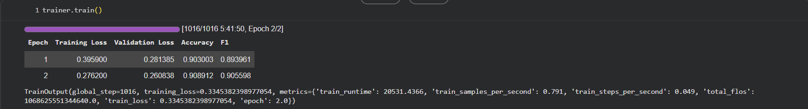

# 📖 Detailed Methodology

This document presents the complete methodology of the incident detection project in medical transport communications.

---

## 1. Context and Objectives

### 1.1 Problem Statement

In the medical transport field, communications between transporters and operators can contain critical information about incidents (delays, breakdowns, transport problems, etc.). Manual detection of these incidents is:
- **Expensive** : Requires constant human monitoring
- **Slow** : Delay between incident and detection
- **Human error** : Risk of missing important incidents

### 1.2 Objectives

1. **Automate detection** : Automatically identify incidents in communications
2. **Reduce false negatives** : Minimize the risk of missing a real incident
3. **Adapt to business context** : Consider risk factors specific to medical transport

---

## 2. Complete NLP Pipeline

### 2.1 Data Collection and Preparation

#### Extraction from MongoDB

Conversations were extracted from the MongoDB database using Python scripts (via the `pymongo` library):
- Identification of conversations containing incidents through internal fields (`incident`, `incident_report`, `not_incident`)
- Data cleaning : removal of automatic messages, duplicates, and texts that are too short
- Export to structured JSONL format, ready for training

#### Data Format

Data is in **JSONL** (JSON Lines) format, where each line represents an example. Messages from the same conversation are **concatenated into a single block**.

#### Train/Test Split

- **Train** : 8,123 examples
- **Test** : 2,031 examples
- **Distribution** : Imbalance preserved (many more non-incidents than incidents) to reflect reality and simulate production conditions

#### Label Encoding

```python
label2id = {
    "non_incident": 0,
    "incident": 1
}
```

### 2.2 Preprocessing

#### Tokenization with CamemBERT

```python
from transformers import CamembertTokenizer

tokenizer = CamembertTokenizer.from_pretrained("camembert-base")

def tokenize_function(batch):
    return tokenizer(
        batch["text"],
        padding="max_length",
        truncation=True,
        max_length=128
    )
```

**Technical choices** :
- **Padding** : `max_length` to uniformize sequences
- **Truncation** : Limited to 128 tokens
- **Real distribution** : Median ≈ 38 tokens, 75th percentile ≈ 69 tokens, max ≈ 1097 tokens
- **Justification** : 128 tokens covers the vast majority of conversations while limiting computation time

### 2.3 Model: CamemBERT

#### Architecture

- **Base model** : `camembert-base` (Hugging Face)
- **Architecture** : Transformer BERT adapted for French
- **Parameters** : ~110M parameters
- **Vocabulary** : 32,000 tokens (SentencePiece)

#### Adaptation for Classification

```python
from transformers import CamembertForSequenceClassification

model = CamembertForSequenceClassification.from_pretrained(
    "camembert-base",
    num_labels=2  # Binary classification
)
```

The model adds a linear classification layer:
- **Input** : [CLS] token representation (768 dimensions)
- **Output** : 2 logits (non_incident, incident)

### 2.4 Training

#### Hyperparameters

```python
TrainingArguments(
    output_dir="./results",
    evaluation_strategy="epoch",
    learning_rate=2e-5,
    per_device_train_batch_size=16,  # GPU memory limitation
    num_train_epochs=2,
    weight_decay=0.01,               # To avoid overfitting
    # Cosine scheduler with warmup
)
```

#### Hyperparameter Justifications

- **Learning rate 2e-5** : Standard for BERT fine-tuning
- **Batch size 16** : GPU memory limitation (Google Colab)
- **2 epochs** : Ensures rapid convergence
- **Weight decay 0.01** : To avoid overfitting
- **Cosine scheduler with warmup** : Learning optimization

#### Training Infrastructure

- **Platform** : Google Colab (free GPU access)
- **Duration** : Training over several hours
- **Flexibility** : Allows testing different parameters

#### Evaluation Metrics

```python
def compute_metrics(eval_pred):
    logits, labels = eval_pred
    predictions = np.argmax(logits, axis=-1)
    acc = accuracy_score(labels, predictions)
    f1 = f1_score(labels, predictions, average="weighted")
    return {"accuracy": acc, "f1": f1}
```

### 2.5 Training Results



#### Training Metrics

| Epoch | Training Loss | Validation Loss | Accuracy | F1-Score (Weighted) |
|-------|---------------|-----------------|----------|---------------------|
| 1     | 0.396         | 0.281           | 0.903    | 0.894               |
| 2     | 0.276         | 0.260           | 0.909    | 0.906               |

**Technical details** :
- **Total duration** : 5h 41min 50s
- **Number of steps** : 1,016
- **Training samples/second** : 0.791

#### Performance on Test Set (Standard Threshold 0.5)

- **Accuracy** : ≈ 90%
- **Global F1-Score** : 0.91
- **Incident F1-Score** : 0.73

**Analysis** :
- ✅ **Global accuracy** : ≈ 90% (excellent)
- ✅ **Global F1-Score** : 0.91 (very good)
- ⚠️ **Incident F1-Score** : 0.73 (acceptable but improvable)
- ⚠️ **False negatives** : The confusion matrix showed the model still produced false negatives (real incidents not detected)

---

## 3. Classification Threshold Optimization

See [THRESHOLD_OPTIMIZATION.md](THRESHOLD_OPTIMIZATION.md) for complete details.

### 3.1 Standard Threshold Problem

With a fixed threshold at 0.5:
- **Too many false negatives** (real incidents not detected)
- **Business risk** : An undetected incident can have serious consequences

### 3.2 Solution 1: Optimal Fixed Threshold (0.90)

At the supervisor's request, the decision threshold impact was studied:
- Extraction of predicted probabilities for the incident class
- Threshold variation from 0.1 to 0.9
- Precision – recall – F1 curve plotting

**Result** : An optimal threshold ≈ **0.90** was identified, which:
- Maximizes recall (incident detection)
- Maintains acceptable precision
- Significantly reduces false negatives

### 3.3 Solution 2: Dynamic Personalization (Experimentation)

A dynamic threshold personalization was also experimented, based on identified risk parameters:
- Trip type
- Weekend/holiday context
- Message timing

This approach allowed for strong reduction of false negatives while keeping false positives under control.

---

## 4. Evaluation and Validation

### 4.1 Metrics Used

- **Accuracy** : Overall performance
- **Precision** : Reliability of positive predictions
- **Recall** : Ability to detect all incidents
- **F1-Score** : Harmonic mean of precision/recall
- **Confusion matrix** : Error visualization

### 4.2 Focus on Recall

In this business context, **recall is more important than precision** :
- **False negative** : Undetected incident → **Critical risk**
- **False positive** : Alert on a non-incident → Manual verification (acceptable)

### 4.3 Business Validation

The custom threshold was validated with business experts for:
- ✅ Drastically reducing false negatives
- ✅ Maintaining acceptable global accuracy
- ✅ Adapting the system to operational constraints

---

## 5. Limitations and Future Improvements

### 5.1 Current Limitations

- **Dataset** : Limited size (8K train, 2K test)
- **Imbalance** : Probable class imbalance (to be specified)
- **Business features** : Manual integration of risk factors
- **Fixed threshold** : 0.05 reduction per criterion (could be optimized)

### 5.2 Possible Improvements

1. **Data augmentation** :
   - Data augmentation (paraphrasing, back-translation)
   - Collection of more incident examples

2. **Threshold optimization** :
   - Automatic learning of weights per criterion
   - Adaptive threshold based on probability distribution

3. **Additional features** :
   - Sentiment analysis
   - Named entities (locations, times, names)
   - Transporter history

4. **Alternative models** :
   - CamemBERT-large (more parameters)
   - Medical domain specialized models
   - Model ensembles

---

## 6. Conclusion

This methodology presents a complete NLP pipeline for incident detection, with a major innovation: **adapting the classification threshold to business context**. This approach allows for drastic reduction of false negatives while maintaining high overall performance.

---

*Document based on the internship report and experimentation notebooks*
